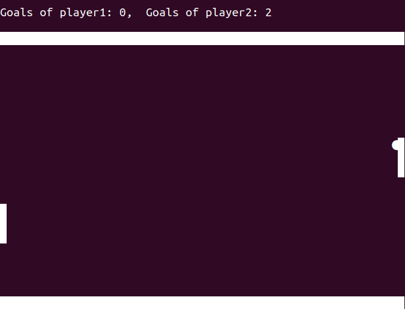

# cli_pong

A classic Pong game for the command line interface. 
Two players can play against each other using simple keyboard controls.

## Quick Info

- Player 1 moves with `w` (up) and `s` (down).
- Player 2 moves with `Arrow Up` and `Arrow Down`.
- Press `Ctrl + C` to stop and `r` to restart the point.
- The game offers plenty of command-line arguments for customization. 
  For a list of available options, run the program with the `--help` flag.

## Screenshots

## Author

Frederik Böcker